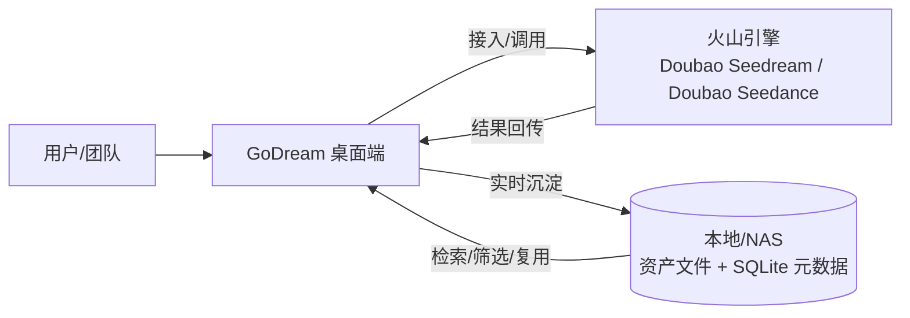

# 图谱：系统关系（桌面端 × 火山模型 × 本地/NAS 资产库）

```mermaid
flowchart LR
  U[用户/团队] --> App[GoDream 桌面端]
  App -->|接入/调用| Volc[火山引擎\nDoubao Seedream / Doubao Seedance]
  Volc -->|结果回传| App
  App -->|实时沉淀| Store[(本地/NAS\n资产文件 + SQLite 元数据)]
  Store -->|检索/筛选/复用| App
```

