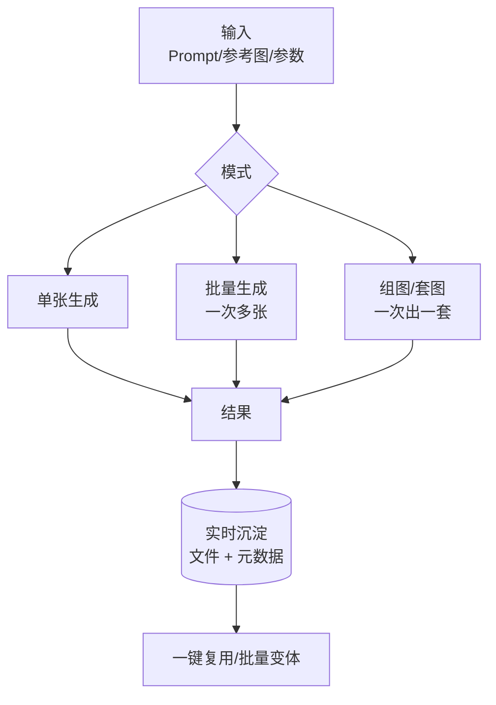

# 图谱：图片工作流（单张 / 批量 / 组图）

```mermaid
flowchart TB
  I[输入\nPrompt/参考图/参数] --> M{模式}
  M --> S[单张生成]
  M --> B[批量生成\n一次多张]
  M --> G[组图/套图\n一次出一套]
  S --> R[结果]
  B --> R
  G --> R
  R --> Store[(实时沉淀\n文件 + 元数据)]
  Store --> Reuse[一键复用/批量变体]
```

