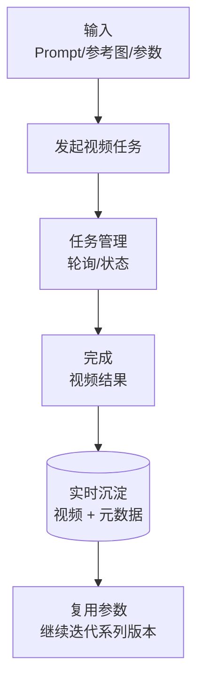

# 图谱：视频工作流（生成→回看→复用）

```mermaid
flowchart TB
  V[输入\nPrompt/参考图/参数] --> T[发起视频任务]
  T --> P[任务管理\n轮询/状态]
  P --> Done[完成\n视频结果]
  Done --> Store[(实时沉淀\n视频 + 元数据)]
  Store --> Reuse[复用参数\n继续迭代系列版本]
```

