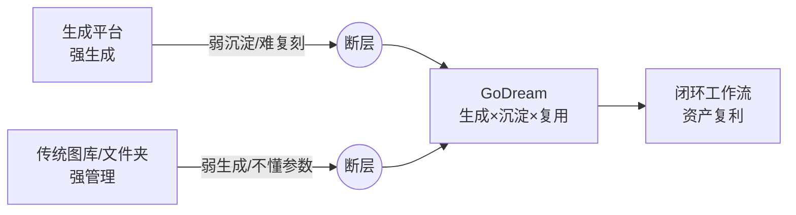

# 图谱：为什么选鸽梦（选型逻辑）

```mermaid
flowchart LR
  Gen[生成平台\n强生成] -->|弱沉淀/难复刻| Gap1((断层))
  Lib[传统图库/文件夹\n强管理] -->|弱生成/不懂参数| Gap2((断层))
  Go[GoDream\n生成×沉淀×复用] --> Value[闭环工作流\n资产复利]
  Gap1 --> Go
  Gap2 --> Go
```

